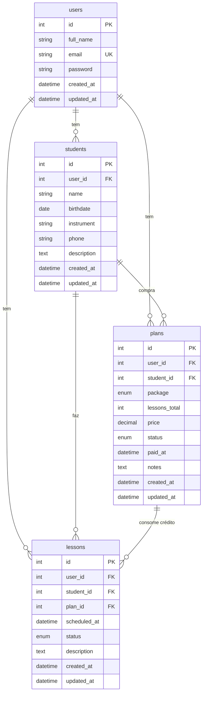
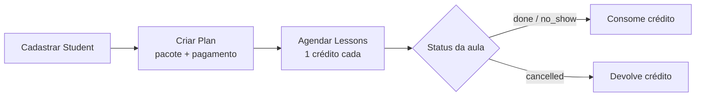

# Music Class — Modelo de dados

Sistema simples para organizar aulas particulares de instrumentos e registrar pagamentos.

Objetivo: estudar AdonisJS e resolver o fluxo real de alunos, pacotes e aulas.

## Contexto de negócio

Planos oferecidos:

| Pacote | Aulas | Preço cheio | Preço ofertado | Por aula |
|--------|------:|------------:|---------------:|---------:|
| Aula avulsa | 1 | R$ 35 | R$ 35 | R$ 35,00 |
| Pacote mensal 1 | 4 | R$ 140 | R$ 130 | R$ 32,50 |
| Pacote mensal 2 | 8 | R$ 280 | R$ 240 | R$ 30,00 |

Cada aula tem 1 hora.

## Ideia central

| Conceito | Significa |
|----------|-----------|
| **Student** | Aluno |
| **Plan** | Compra de um pacote (créditos + pagamento) |
| **Lesson** | Aula agendada ou realizada (consome 1 crédito) |
| **User** | Professor (dono dos registros; já existe no Adonis) |

`Plan` **não** é cópia de `Lesson`.  
`Plan` = pacote comprado. `Lesson` = aula que gasta 1 crédito desse pacote.

Aula avulsa também cria um `Plan` (`single`, 1 crédito). Mesmo fluxo para todos os casos.

## Diagrama de relacionamentos



Cardinalidade:

```
User 1 ──* Student
User 1 ──* Plan
User 1 ──* Lesson

Student 1 ──* Plan
Student 1 ──* Lesson

Plan 1 ──* Lesson
```

## Fluxo (visão rápida)



## Catálogo de preços (código, não tabela)

Os 3 pacotes são fixos. Ficam como constante na aplicação:

```ts
export const PACKAGES = {
  single: { lessons: 1, price: 35 },
  pack_4: { lessons: 4, price: 130 },
  pack_8: { lessons: 8, price: 240 },
} as const
```

Só vale criar tabela `plan_types` depois, se precisar editar preços pela interface.

## Tabelas

### `users` (já existe)

Professor autenticado no sistema. Usado como `user_id` nas demais tabelas para isolar os dados.

| Campo | Tipo | Obrigatório | Nota |
|-------|------|:-----------:|------|
| id | int | sim | PK |
| full_name | string | não | |
| email | string | sim | Único |
| password | string | sim | |
| created_at | datetime | sim | |
| updated_at | datetime | não | |

### `students`

| Campo | Tipo | Obrigatório | Nota |
|-------|------|:-----------:|------|
| id | int | sim | PK |
| user_id | FK → users | sim | Professor dono |
| name | string | sim | |
| birthdate | date | não | |
| instrument | string | sim | Ex.: violão |
| phone | string | não | Contato / WhatsApp |
| description | text | não | Observações gerais |
| created_at | datetime | sim | |
| updated_at | datetime | não | |

### `plans`

Compra do pacote pelo aluno.

| Campo | Tipo | Obrigatório | Nota |
|-------|------|:-----------:|------|
| id | int | sim | PK |
| user_id | FK → users | sim | |
| student_id | FK → students | sim | |
| package | enum | sim | `single` \| `pack_4` \| `pack_8` |
| lessons_total | int | sim | 1, 4 ou 8 |
| price | decimal(8,2) | sim | 35 / 130 / 240 |
| status | enum | sim | `pending` \| `paid` \| `cancelled` |
| paid_at | datetime | não | `null` = ainda não pagou |
| notes | text | não | |
| created_at | datetime | sim | |
| updated_at | datetime | não | |

### `lessons`

Aula individual ligada a um pacote.

| Campo | Tipo | Obrigatório | Nota |
|-------|------|:-----------:|------|
| id | int | sim | PK |
| user_id | FK → users | sim | |
| student_id | FK → students | sim | |
| plan_id | FK → plans | sim | Pacote que esta aula consome |
| scheduled_at | datetime | sim | Data e hora da aula |
| status | enum | sim | `scheduled` \| `done` \| `cancelled` \| `no_show` |
| description | text | não | O que foi treinado / anotações |
| created_at | datetime | sim | |
| updated_at | datetime | não | |

## Fluxo do dia a dia

1. Cadastrar o aluno em `students`.
2. Aluno compra um pacote → criar `plan`  
   Ex.: `package: pack_4`, `lessons_total: 4`, `price: 130`, `status: paid`.
3. Agendar aulas → criar `lessons` com o `plan_id` correspondente.
4. Após a aula → atualizar `status` para `done`.
5. Créditos restantes:

```text
restantes = lessons_total - quantidade de aulas com status != cancelled
```

## Regras de domínio

- Não permitir mais aulas ativas em um `plan` do que `lessons_total`.
- Cancelar aula (`cancelled`) **devolve** crédito.
- Falta (`no_show`) **consome** crédito (pode ser tratado como `done` se preferir outra política).
- Pagamento fica no próprio `plan` (`price` + `status` + `paid_at`). Sem tabela `payments` na v1.

## Fora do escopo (v1)

- Tabela separada de pagamentos
- Tabela de tipos de plano editáveis
- Múltiplos professores com papéis complexos (`user_id` já isola se um dia precisar)
- Financeiro avançado (comissões, recorrência automática, etc.)
